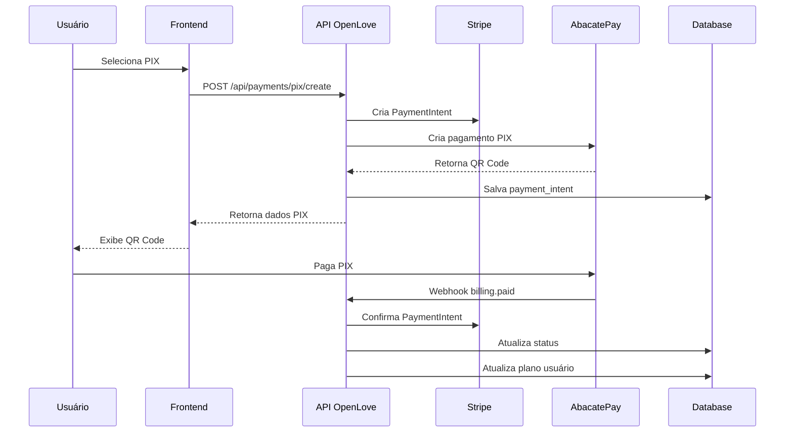

# Integração AbacatePay + Stripe

Guia completo para integrar pagamentos PIX via AbacatePay com o sistema Stripe existente.

## 📋 Pré-requisitos

### 1. Configuração do AbacatePay

1. **Criar conta no AbacatePay**
   - Acesse [dashboard.abacatepay.com](https://dashboard.abacatepay.com)
   - Cadastre-se e configure sua conta

2. **Gerar chave API**
   - No dashboard, vá em "API Keys"
   - Gere uma chave para desenvolvimento
   - Gere uma chave para produção
   - Copie as chaves para o `.env.local`

3. **Configurar webhook**
   - URL do webhook: `https://seudominio.com/api/payments/pix/webhook`
   - Evento: `billing.paid`

### 2. Configuração do Stripe

1. **Criar método de pagamento personalizado**
   - No dashboard Stripe, vá em "Payment Methods"
   - Crie um método personalizado para PIX
   - Use o ID fornecido: `cpmt_1Rlib2FLZANOl02HqsXhMWUO`

2. **Configurar produtos**
   - Certifique-se de que os produtos estão criados no Stripe
   - IDs dos produtos devem estar na configuração

## 🔧 Configuração das Variáveis de Ambiente

```env
# AbacatePay
ABACATEPAY_API_KEY="sua_chave_api_abacatepay"
ABACATEPAY_WEBHOOK_SECRET="sua_chave_webhook_abacatepay"

# Stripe (já existente)
STRIPE_SECRET_KEY="sua_chave_stripe"
STRIPE_WEBHOOK_SECRET="sua_chave_webhook_stripe"
```

## 🚀 Fluxo de Integração

### 1. Criar Pagamento PIX

```typescript
// POST /api/payments/pix/create
{
  "planType": "gold", // ou "diamante", "diamante_anual"
  "paymentMethodId": "pm_pix_custom"
}
```

**Resposta:**
```json
{
  "success": true,
  "data": {
    "clientSecret": "pi_xxx_secret_xxx",
    "pixCode": "00020126580014br.gov.bcb.pix...",
    "pixQrCode": "iVBORw0KGgoAAAANSUhEUgAA...",
    "abacatePayId": "abp_xxx",
    "stripePaymentIntentId": "pi_xxx",
    "expiresAt": "2025-01-17T15:30:00Z",
    "amount": 2500,
    "currency": "brl",
    "planName": "Open Ouro"
  }
}
```

### 2. Verificar Status do Pagamento

```typescript
// POST /api/payments/pix/status
{
  "abacatePayId": "abp_xxx",
  "stripePaymentIntentId": "pi_xxx"
}
```

### 3. Simular Pagamento (Desenvolvimento)

```typescript
// POST /api/payments/pix/simulate
{
  "abacatePayId": "abp_xxx"
}
```

## 🔄 Fluxo de Dados



## 📊 Estrutura do Banco de Dados

### Tabela: `payment_intents`
```sql
CREATE TABLE payment_intents (
  id UUID PRIMARY KEY,
  user_id UUID NOT NULL,
  stripe_payment_intent_id VARCHAR(255) NOT NULL,
  abacatepay_payment_id VARCHAR(255),
  amount INTEGER NOT NULL,
  currency VARCHAR(3) DEFAULT 'brl',
  plan_type VARCHAR(50) NOT NULL,
  payment_method VARCHAR(50) DEFAULT 'pix',
  status VARCHAR(50) DEFAULT 'pending',
  expires_at TIMESTAMP,
  paid_at TIMESTAMP,
  created_at TIMESTAMP DEFAULT NOW(),
  updated_at TIMESTAMP DEFAULT NOW()
);
```

### Tabela: `webhook_logs`
```sql
CREATE TABLE webhook_logs (
  id UUID PRIMARY KEY,
  provider VARCHAR(50) NOT NULL,
  event_type VARCHAR(100) NOT NULL,
  payment_id VARCHAR(255),
  status VARCHAR(50),
  error_message TEXT,
  data JSONB,
  processed_at TIMESTAMP DEFAULT NOW()
);
```

## 🎨 Componentes React

### 1. PaymentMethodSelector
Componente para escolher entre PIX e Cartão de Crédito.

```tsx
import PaymentMethodSelector from '@/components/payments/PaymentMethodSelector'

<PaymentMethodSelector 
  planType="gold"
  onSuccess={() => console.log('Pagamento realizado!')}
  onError={(error) => console.error(error)}
/>
```

### 2. PixPayment
Componente completo para pagamento PIX.

```tsx
import PixPayment from '@/components/payments/PixPayment'

<PixPayment 
  planType="diamante"
  onSuccess={() => router.push('/dashboard')}
  onError={(error) => toast.error(error)}
/>
```

## 🔐 Segurança

### Validação de Webhooks
```typescript
// Validar webhook do AbacatePay
const signature = request.headers.get('x-abacatepay-signature')
const payload = await request.text()

if (!validateWebhookSignature(payload, signature)) {
  return new Response('Invalid signature', { status: 401 })
}
```

### Verificação de Origem
- Validar IP do webhook
- Verificar timestamp da requisição
- Validar assinatura HMAC

## 🚨 Tratamento de Erros

### Erros Comuns

1. **Token inválido**
```json
{
  "error": "AbacatePay API Error: 401 - Invalid token"
}
```

2. **Pagamento expirado**
```json
{
  "error": "Payment expired"
}
```

3. **Método de pagamento inválido**
```json
{
  "error": "Método de pagamento inválido para PIX"
}
```

## 📈 Monitoramento

### Logs Importantes
- Criação de pagamentos PIX
- Status de webhooks
- Erros de integração
- Tempos de resposta

### Métricas
- Taxa de conversão PIX vs Cartão
- Tempo médio de pagamento
- Taxa de expiração de PIX
- Erros por tipo

## 🧪 Testes

### Desenvolvimento
```bash
# Simular pagamento PIX
curl -X POST http://localhost:3000/api/payments/pix/simulate \
  -H "Content-Type: application/json" \
  -d '{"abacatePayId": "abp_xxx"}'
```

### Produção
- Usar valores reais pequenos para teste
- Configurar webhooks de teste
- Validar fluxo completo

## 📝 Checklist de Implementação

- [ ] Configurar chaves API do AbacatePay
- [ ] Criar método de pagamento personalizado no Stripe
- [ ] Executar migrations do banco de dados
- [ ] Configurar webhooks do AbacatePay
- [ ] Testar fluxo completo em desenvolvimento
- [ ] Implementar componentes React
- [ ] Configurar monitoramento
- [ ] Validar segurança dos webhooks
- [ ] Testar em produção com valores baixos
- [ ] Documentar fluxo para equipe

## 🔄 Manutenção

### Verificações Regulares
- Status dos webhooks
- Logs de erro
- Performance da API
- Taxa de sucesso dos pagamentos

### Atualizações
- Monitorar mudanças na API AbacatePay
- Atualizar dependências
- Revisar logs de segurança
- Otimizar performance

## 📞 Suporte

### AbacatePay
- Email: ajuda@abacatepay.com
- Documentação: https://docs.abacatepay.com

### Stripe
- Dashboard: https://dashboard.stripe.com
- Documentação: https://stripe.com/docs

## 🎯 Próximos Passos

1. **Implementar recorrência para planos mensais**
2. **Adicionar relatórios de pagamento**
3. **Implementar reembolsos via PIX**
4. **Otimizar UX do fluxo de pagamento**
5. **Adicionar analytics avançados**