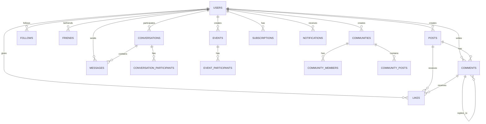

# OpenLove - Database Relationships

## Entity Relationship Overview



## Core Relationships

### 1. Users as Central Entity
```sql
users (1) -----> (N) posts
users (1) -----> (N) comments  
users (1) -----> (N) likes
users (1) -----> (N) follows
users (1) -----> (N) friends
users (1) -----> (N) messages
users (1) -----> (N) events
users (1) -----> (N) communities
users (1) -----> (N) subscriptions
users (1) -----> (N) notifications
```

### 2. Content Hierarchy
```sql
posts (1) -----> (N) comments
posts (1) -----> (N) likes (target_type='post')
comments (1) -----> (N) likes (target_type='comment')
comments (1) -----> (N) comments (parent_id) -- Threading
```

### 3. Social Network
```sql
users (1) -----> (N) follows (follower_id)
users (1) -----> (N) follows (following_id)
users (1) -----> (N) friends (user_id)
users (1) -----> (N) friends (friend_id)
```

### 4. Messaging System
```sql
conversations (1) -----> (N) conversation_participants
conversations (1) -----> (N) messages
users (1) -----> (N) conversation_participants
users (1) -----> (N) messages (sender_id)
messages (1) -----> (N) messages (reply_to_id) -- Threading
```

### 5. Events & Communities
```sql
users (1) -----> (N) events (creator_id)
users (1) -----> (N) communities (creator_id)
events (1) -----> (N) event_participants
communities (1) -----> (N) community_members
communities (1) -----> (N) community_posts
posts (1) -----> (N) community_posts
```

## Detailed Table Relationships

### Users Table Connections
| Related Table | Foreign Key | Relationship Type | Description |
|---------------|-------------|------------------|-------------|
| posts | user_id | One-to-Many | User creates posts |
| comments | user_id | One-to-Many | User writes comments |
| likes | user_id | One-to-Many | User gives likes/reactions |
| follows | follower_id, following_id | Many-to-Many | User follows/is followed |
| friends | user_id, friend_id | Many-to-Many | User friendships |
| messages | sender_id | One-to-Many | User sends messages |
| conversations | created_by | One-to-Many | User creates conversations |
| conversation_participants | user_id | One-to-Many | User participates in conversations |
| events | creator_id | One-to-Many | User creates events |
| event_participants | user_id | One-to-Many | User participates in events |
| communities | creator_id | One-to-Many | User creates communities |
| community_members | user_id | One-to-Many | User joins communities |
| subscriptions | user_id | One-to-Many | User has subscriptions |
| notifications | recipient_id, sender_id | One-to-Many | User receives/sends notifications |

### Posts Table Connections
| Related Table | Foreign Key | Relationship Type | Description |
|---------------|-------------|------------------|-------------|
| users | user_id | Many-to-One | Post belongs to user |
| comments | post_id | One-to-Many | Post has comments |
| likes | target_id (where target_type='post') | One-to-Many | Post receives likes |
| community_posts | post_id | One-to-Many | Post can be in communities |

### Comments Table Connections
| Related Table | Foreign Key | Relationship Type | Description |
|---------------|-------------|------------------|-------------|
| posts | post_id | Many-to-One | Comment belongs to post |
| users | user_id | Many-to-One | Comment written by user |
| comments | parent_id | One-to-Many | Comment replies to comment |
| likes | target_id (where target_type='comment') | One-to-Many | Comment receives likes |

### Likes Table (Unified System)
| Related Table | Foreign Key | Relationship Type | Description |
|---------------|-------------|------------------|-------------|
| users | user_id | Many-to-One | Like given by user |
| posts | target_id (where target_type='post') | Many-to-One | Like on post |
| comments | target_id (where target_type='comment') | Many-to-One | Like on comment |

## Constraint Rules

### Self-Referencing Constraints
```sql
-- Users cannot follow themselves
ALTER TABLE follows ADD CONSTRAINT follows_no_self_follow 
CHECK (follower_id != following_id);

-- Users cannot befriend themselves  
ALTER TABLE friends ADD CONSTRAINT friends_no_self_friend 
CHECK (user_id != friend_id);
```

### Unique Constraints
```sql
-- One follow relationship per user pair
ALTER TABLE follows ADD CONSTRAINT follows_unique 
UNIQUE (follower_id, following_id);

-- One friendship per user pair
ALTER TABLE friends ADD CONSTRAINT friends_unique 
UNIQUE (user_id, friend_id);

-- One like per user per target
ALTER TABLE likes ADD CONSTRAINT likes_unique 
UNIQUE (user_id, target_id, target_type);
```

### Data Integrity Rules
```sql
-- Target type validation in likes
ALTER TABLE likes ADD CONSTRAINT likes_target_type_check 
CHECK (target_type IN ('post', 'comment'));

-- Status validation
ALTER TABLE follows ADD CONSTRAINT follows_status_check 
CHECK (status IN ('active', 'blocked'));

ALTER TABLE friends ADD CONSTRAINT friends_status_check 
CHECK (status IN ('pending', 'accepted', 'blocked', 'declined'));
```

## Cascading Deletes

### User Deletion Effects
When a user is deleted, the following happens:
- ✅ **Posts**: Deleted (CASCADE)
- ✅ **Comments**: Deleted (CASCADE)  
- ✅ **Likes**: Deleted (CASCADE)
- ✅ **Follows**: Deleted (CASCADE)
- ✅ **Friends**: Deleted (CASCADE)
- ✅ **Messages**: Deleted (CASCADE)
- ✅ **Conversations**: Deleted if created_by (CASCADE)
- ✅ **Events**: Deleted if creator (CASCADE)
- ✅ **Communities**: Deleted if creator (CASCADE)
- ✅ **Subscriptions**: Deleted (CASCADE)
- ✅ **Notifications**: Deleted (CASCADE)

### Post Deletion Effects
When a post is deleted:
- ✅ **Comments**: Deleted (CASCADE)
- ✅ **Likes**: Deleted (CASCADE via target_id)
- ✅ **Community Posts**: Deleted (CASCADE)

### Comment Deletion Effects
When a comment is deleted:
- ✅ **Child Comments**: Deleted (CASCADE via parent_id)
- ✅ **Likes**: Deleted (CASCADE via target_id)

## JSON Relationships

### Embedded References
Some relationships are stored as JSON for flexibility:

```sql
-- Posts event details
posts.event_details = {
  "event_id": "uuid",
  "event_type": "social|business|cultural",
  "rsvp_required": boolean
}

-- User stats (denormalized for performance)
users.stats = {
  "posts": count,
  "followers": count,
  "following": count,
  "friends": count,
  "likes_received": count
}

-- Post stats (updated by triggers)
posts.stats = {
  "likes_count": count,
  "comments_count": count,
  "shares_count": count,
  "views_count": count
}
```

## Query Patterns

### Common Join Patterns
```sql
-- Get posts with user info and stats
SELECT p.*, u.username, u.avatar_url, p.stats->'likes_count' as likes
FROM posts p
JOIN users u ON p.user_id = u.id
WHERE p.visibility = 'public';

-- Get user's timeline (following posts)
SELECT p.*, u.username
FROM posts p
JOIN users u ON p.user_id = u.id
JOIN follows f ON f.following_id = p.user_id
WHERE f.follower_id = $user_id;

-- Get comments with threading
WITH RECURSIVE comment_tree AS (
  SELECT c.*, 0 as level
  FROM comments c 
  WHERE c.post_id = $post_id AND c.parent_id IS NULL
  
  UNION ALL
  
  SELECT c.*, ct.level + 1
  FROM comments c
  JOIN comment_tree ct ON c.parent_id = ct.id
)
SELECT * FROM comment_tree ORDER BY level, created_at;
```

This relationship structure ensures data integrity while providing flexibility for the social media features of OpenLove.