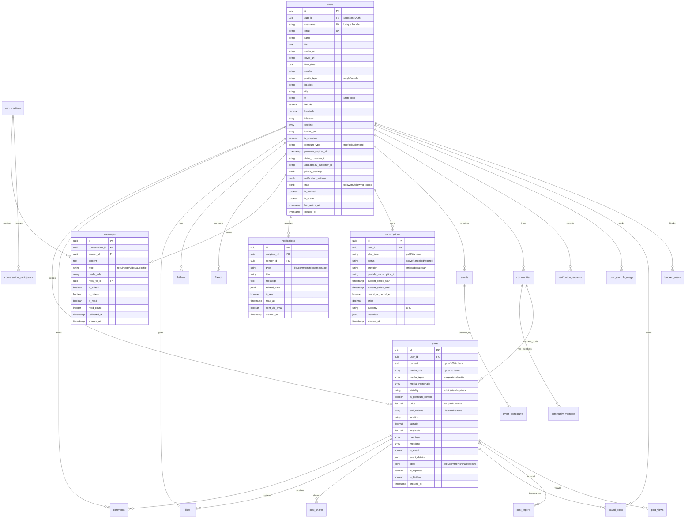
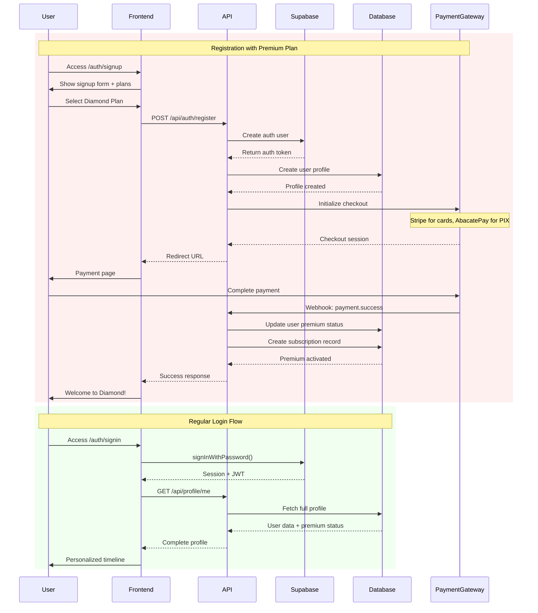
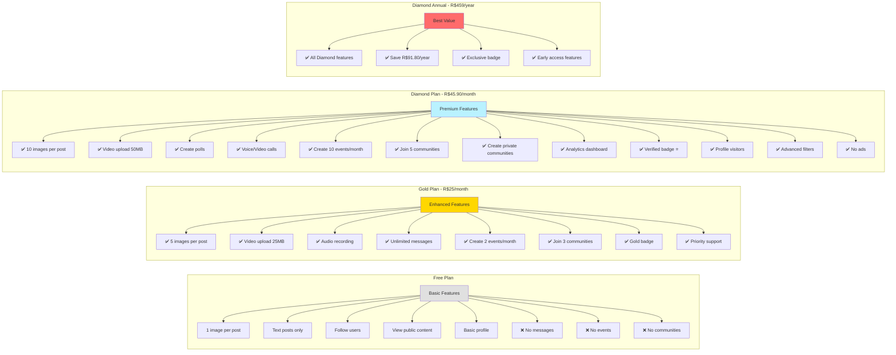
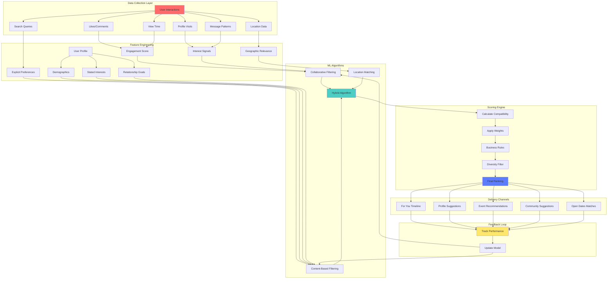
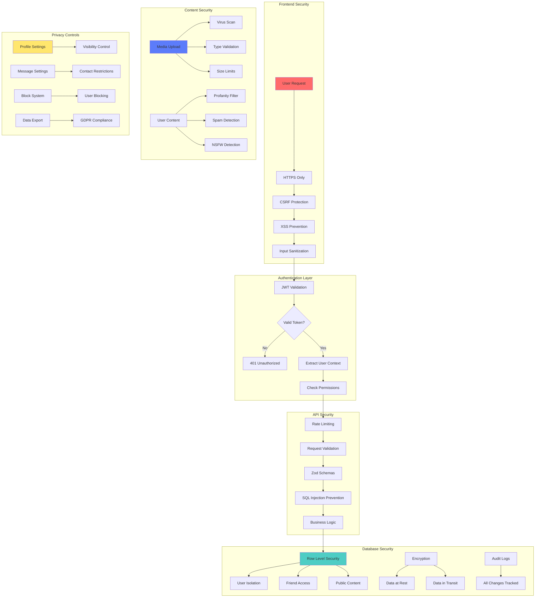
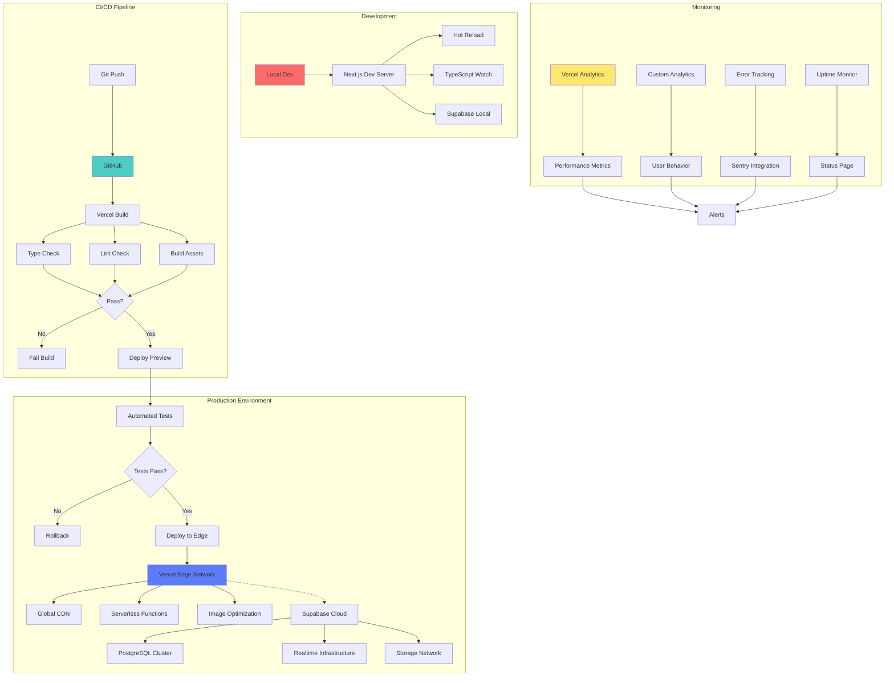

# OpenLove Architecture Documentation 2025

## System Architecture Overview

```mermaid
graph TB
    subgraph "Frontend Layer - Next.js 15 App Router"
        A[Client Browser] --> B[Next.js Pages]
        B --> C[React 19 Components]
        C --> D[Hero UI + Tailwind CSS]
        C --> E[Zustand State Management]
        C --> F[React Hook Form]
        B --> G[Server Components]
        B --> H[Client Components]
        
        subgraph "Key Pages"
            B --> I[/timeline - Main Feed]
            B --> J[/messages - Chat System]
            B --> K[/profile - User Profiles]
            B --> L[/events - Events System]
            B --> M[/communities - Groups]
            B --> N[/pricing - Plans]
        end
    end
    
    subgraph "API Layer - 65+ Endpoints"
        O[API Routes] --> P[/api/auth - Authentication]
        O --> Q[/api/posts - Content Management]
        O --> R[/api/chat - Messaging]
        O --> S[/api/payments - Monetization]
        O --> T[/api/notifications - Alerts]
        O --> U[/api/users - User Management]
        O --> V[/api/upload - Media]
        O --> W[/api/ai - Recommendations]
    end
    
    subgraph "Backend Services - Supabase"
        X[Supabase Platform] --> Y[PostgreSQL 15 Database]
        X --> Z[Realtime WebSockets]
        X --> AA[Storage CDN]
        X --> AB[Auth JWT System]
        X --> AC[Edge Functions]
        Y --> AD[Row Level Security]
        Y --> AE[25+ Tables]
        Y --> AF[Triggers & Functions]
    end
    
    subgraph "External Services"
        AG[Stripe API] --> AH[Credit Card Payments]
        AI[AbacatePay] --> AJ[PIX Payments Brazil]
        AK[IBGE API] --> AL[Brazilian Location Data]
        AM[WebRTC] --> AN[Video/Voice Calls]
        AO[Redis Cache] --> AP[Session Management]
    end
    
    subgraph "Infrastructure"
        AQ[Vercel Platform] --> AR[Global Edge Network]
        AQ --> AS[Serverless Functions]
        AQ --> AT[Image Optimization]
        AU[Cloudflare] --> AV[DDoS Protection]
        AU --> AW[Global CDN]
    end
    
    H -.-> O
    O -.-> X
    O -.-> AG
    O -.-> AI
    O -.-> AK
    R -.-> AM
    O -.-> AO
    AA -.-> AW
    
    style A fill:#ff6b6b,stroke:#ff5252,color:#fff
    style X fill:#4ecdc4,stroke:#45b7b8,color:#fff
    style AG fill:#5c7cfa,stroke:#4c6ef5,color:#fff
    style AQ fill:#ffe66d,stroke:#ffd43b,color:#333
```

## Database Schema (25+ Tables)



## Authentication & Payment Flow



## Real-time Architecture

```mermaid
graph TB
    subgraph "Chat System"
        A[User sends message] --> B[Chat Component]
        B --> C[Supabase Realtime]
        C --> D[PostgreSQL Insert]
        D --> E[Trigger notification]
        C --> F[WebSocket broadcast]
        F --> G[Update all participants]
        
        H[Typing indicator] -.-> C
        I[Read receipts] -.-> C
        J[Online presence] -.-> C
    end
    
    subgraph "Notifications"
        K[User action] --> L[Create notification]
        L --> M[Insert to DB]
        M --> N[Realtime broadcast]
        N --> O[Update badge count]
        N --> P[Show toast]
        N --> Q[Play sound]
        
        R[Email notifications] -.-> M
        S[Push notifications] -.-> M
    end
    
    subgraph "Timeline Updates"
        T[New post] --> U[Insert post]
        U --> V[Update followers feeds]
        U --> W[Update hashtag feeds]
        U --> X[Update location feeds]
        U --> Y[AI recommendation update]
        
        V --> Z[Realtime channel]
        W --> Z
        X --> Z
        Z --> AA[Push to online users]
    end
    
    subgraph "WebRTC Features"
        AB[Voice call] --> AC[Signaling server]
        AD[Video call] --> AC
        AE[Screen share] --> AC
        AC --> AF[P2P connection]
        AF --> AG[Direct communication]
    end
    
    style A fill:#ff6b6b
    style K fill:#4ecdc4
    style T fill:#5c7cfa
    style AB fill:#ffe66d
```



## Premium Plans & Features



## AI Recommendation System



## Security Architecture



## Deployment Architecture



## Project Statistics

- **Total Files**: 850+
- **React Components**: 120+
- **API Endpoints**: 65+
- **Database Tables**: 25+
- **Lines of Code**: 45,000+
- **Development Time**: 3 months
- **Current Version**: 0.3.0-alpha.2

## Technology Stack Summary

### Frontend
- Next.js 15.3.5 (App Router)
- React 19.1.0
- TypeScript 5
- Tailwind CSS 3.4
- Hero UI Components
- Framer Motion 12
- Zustand State Management

### Backend
- Supabase (PostgreSQL 15)
- Redis Cache
- WebRTC for calls
- Edge Functions

### Payments
- Stripe (International)
- AbacatePay (Brazil PIX)

### Infrastructure
- Vercel (Hosting)
- Cloudflare (CDN/DDoS)
- GitHub (Version Control)

---

*Generated: January 27, 2025*
*OpenLove - Connecting people through love and technology*